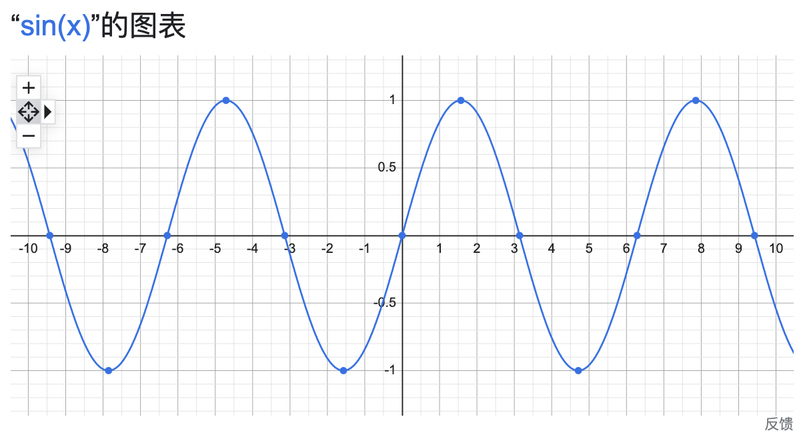
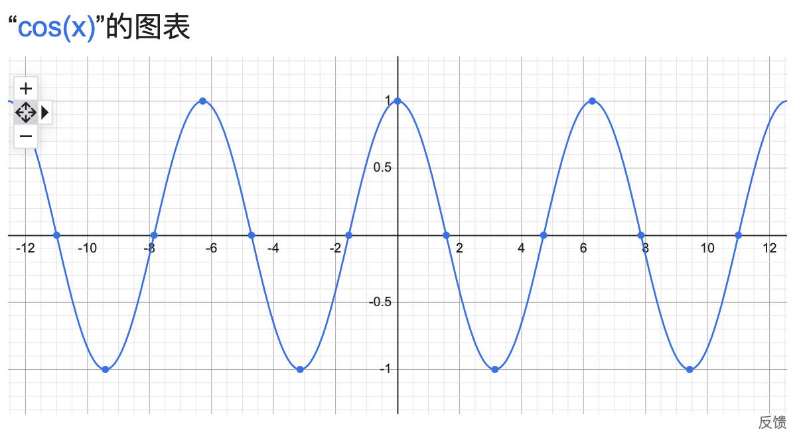
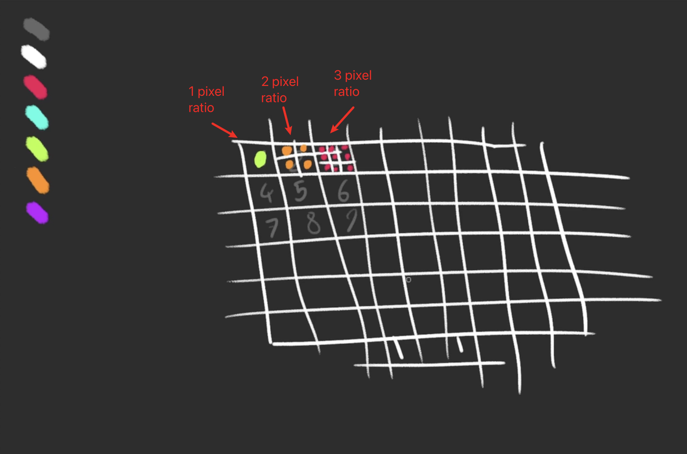
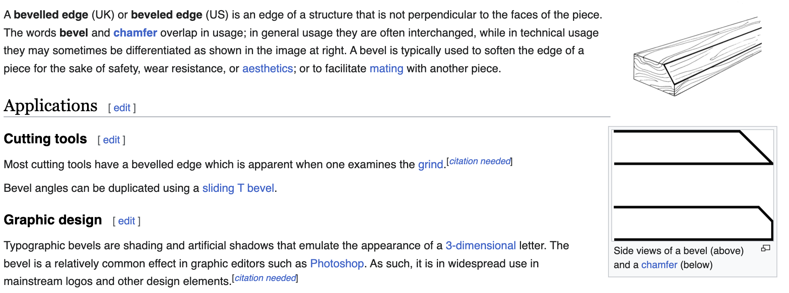
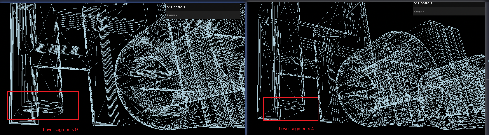
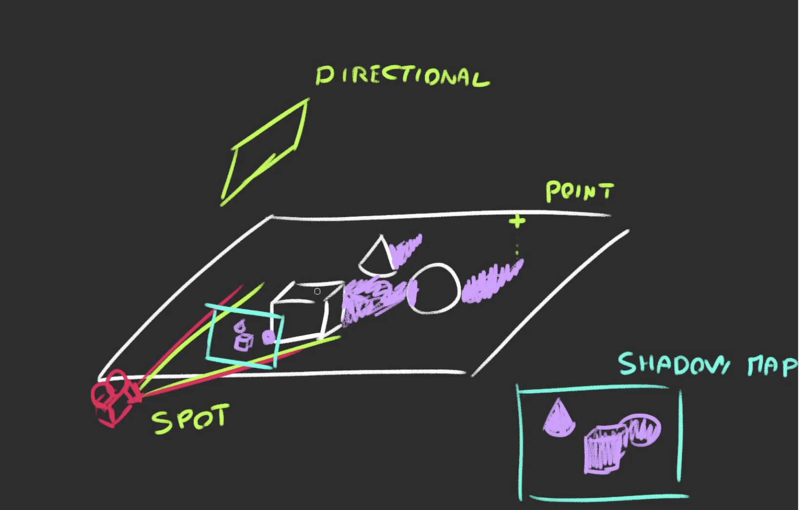

# Notes of Three.js Journey by Bruno Simon

## 1. Introduction

Three.js is a JavaScript library that enables developers to create 3D experiences for the wev.
It works with WebGL, but you can make it work with SVG and CSS but those too are quite limited, and not as performant as WebGL.

- WebGL is so fast because it uses the GPU to render the scene. WebGL can be used to draw both _2D_ and _3D_ graphics.
- The CPU can do calculations really fast but one by one, while the GPU is a little slower but can do thousands of parallel calculations.
- The instructions to place the points (geometry) and draw the pixels (color) are written in **shaders**. We provide information to those shaders like the points positions, model transformations, camera coordinates and things to get positions and colorized the way we want.

## 2. Basic Scene

A basic scene in Three.js is composed of FOUR elements: a **scene**, an **object**, a **camera** and a **renderer**.

- The **scene** is the like a set in a movie.
- The object in Three.js is called a **mesh**, which requires a geometry(shape) and a material(how it looks).
- The **camera** is what makes the object visible. Take perspective camera for example, it usually has a **field of view** (FOV), aspect ratio (width / height), a **near** and **far** clipping plane.
- a **renderer** is the result that gets drawn to the canvas, usually the HTML canvas element. We have to specify the size of the canvas, and call the render method to make the magic happen.

## 3. Transform Objects

There are 4 properties to transform objects:

- **position**
- **scale**
- **rotation**
- **quaternion**: the rotation of the object in a different way.

All classes that inherit from **Object3D** have these properties, like _PerspectiveCamera_, _Mesh_, _Group_ and _Scene_. See inheritance in [documentation](https://threejs.org/docs/#api/en/core/Object3D).

These properties will be compile into **matrices**(singular: **matrix**). The matrix is a 4x4 matrix that contains all the information about the position, rotation and scale of the object. The matrix is used to transform the object in the scene.

- `Axis` in Three.js: **x** is right, **y** is up, **z** is forward, just like coordinate system in math.
- `position` inherits from `Vector3`, which has `x`, `y` and `z` properties and many useful methods. You can get the length of a vector by calling `mesh.position.length()`. You can normalize a vector by calling `mesh.position.normalize()`, which will make the vector have a length of 1, just like an interval of the x-axis in math.
- `AxesHelper` is a useful tool to visualize the axes of an object. It takes the size of the axes as the only argument.
- `rotation` also has `x`, `y` and `z` properties, but it's a **Euler**. When you change the `x`, `y` or `z` property, you can imagine putting a stick through your object's center in the axis's direction and then rotating that object on that stick. The value of these properties is in **radians**. Half a circle is `Math.PI`, a full circle is `Math.PI * 2`.
- `reorder` is a method of `Euler` that takes a string as the only argument. The string can be `XYZ`, `XZY`, `YXZ`, `YZX`, `ZXY`, `ZYX`. It will change the order of the rotation. Why do we need this? For example, if you rotate an object 90 degrees around the x-axis, then 90 degrees around the y-axis, the result will be different from rotating 90 degrees around the y-axis, then 90 degrees around the x-axis. The first one will rotate the object 90 degrees around the z-axis, while the second one will rotate the object 90 degrees around the x-axis.
- `Quaternion` also expresses a rotation, but in a more mathematical way. Remember: `quaternion` updates when you change the `rotation`.
- `Object3D` instances have a `lookAt()` method which rotates the object so that its `-z` faces the target you provided. The target must be a `Vector3`.
- scene graph: you can put objects inside groups and use `position`, `rotation` and `scale` to transform the group. To do that, use the `Group` class.

## 4. Animations

The purpose of `requestAnimationFrame()` is to call the function provided on the **next** frame. It's not doing animation. Basically, when you pass a callback function to `requestAnimationFrame()`, the browser will call that function approximately 60 times per second.

- The advantages of `requestAnimationFrame()` over `setInterval()` and `setTimeout()` are:

  - It's synchronized with the browser's repaint cycle, which means that the animation is updated only when the browser is ready to repaint the screen. This allows the animation to be updated at the optimal time, resulting in a smoother and more efficient animation. However, `setTimeout()` and `setInterval()` are not synchronized with the browser's repaint cycle, which can result in janky or stuttering animations. For example, let's say you use setInterval() to update the position of an element every 10 milliseconds. If the browser is able to repaint the screen faster than every 10 milliseconds, the animation may appear janky or stuttering because it's updating at a fixed interval, regardless of whether the browser has finished rendering the previous frame.
  - It pauses when the user navigates to another browser tab, hence not wasting their precious processing power and battery life.

- Don't use `getDelta()` , use `getElapsedTime()` instead.
- _GSAP_ is a JavaScript animation library for creating high-performance animations that work in every major browser. It's a great alternative to `requestAnimationFrame()`.

## 5. Cameras

**PerspectiveCamera(透视相机)** is like the human eye, the closer object appears larger, and vice versa. It's used in photography, film and 3d video games.
**OrthographicCamera(正交相机)** is like a camera with a fixed lens, the object appears the same size regardless of how far it is from the camera. It's used in architecture, engineering and 2d video games(object sizes must be consistent).

- Don't use extreme values like 0.0001 or 99999 for the near and far clipping plane. It will cause z-fighting (glitching).
- Math.sin() starts at 0, Math.cos() starts at 1. Math.PI is half a circle, Math.PI \* 2 is a full circle.




**Controls**:

- `OrbitControls` is like a camera orbiting around a target. Except it doesn't goes under the plane.
- `TrackballControls` is like `OrbitControls`, but it goes under the plane.
- `FlyControls` and `FirstPersonControls` are alike, but `FlyControls` is more like a plane, it can roll over.
- `PointerLockControls` is like minecraft, you can move and jump,
- `ArcballControls` is like examining a prop in a game, like purchasing a gun in Counter-Strike.
- `DragControls` can drag objects. It has nothing to do with the camera.
- `TransformControls` can move, rotate and scale objects.

For `OrbitControls`, The damping will smooth the animation by adding some kind of acceleration and friction. It's like real-life motion, with inertia.

## 6. Resizing & Fullscreen

1. `camera.updateProjectionMatrix()` updates the camera's projection matrix in Three.js, which is used to calculate how 3D objects are projected onto a 2D screen or window. This method needs to be called whenever the _camera's properties_ or _canvas size_ change to ensure the scene is rendered correctly. If you have multiple cameras in your Three.js application, you may need to manually call this method for each camera. However, if you only have one camera, Three.js will automatically update its projection matrix in each frame.

2. `pixelRatio`：

- History: few years ago, all screens had a pixel ratio of 1. Constructors like Apple started building screens with a pixel ratio of 2. Now, there are even higher pixel ratios like 3.
- A pixel ratio of 2 means 4 times more pixels than a pixel ratio of 1. A pixel ratio of 3 means 9 times more pixels than a pixel ratio of 1. Highest pixel ratios are usually on the weakest devices - mobiles.



- Why update pixel ratio when resizing window?
  - When you resize the window, you are actually changing the size and resolution of the visible area of the window, even on the same monitor. This may cause the pixel ratio to be incorrect, which can result in a loss of rendering quality and clarity. Therefore, it is necessary to update the pixel ratio to ensure that the rendered image always has the correct clarity and quality, even when resizing the window on the same monitor. In Three.js, the pixel ratio needs to be updated every time the window is resized.

3. **FullScreen**:

- `document.fullscreenElement` returns the element that is currently displayed in full screen mode. If there is no element in full screen mode, it returns `null`.
- `document.exitFullscreen()` exits full screen mode.
- `canvas.requestFullscreen()` requests full screen mode for the canvas element.

_Note_: `document.fullscreenElement` is not supported by IE and Safari. Instead, use `document.fullscreenElement || document.mozFullScreenElement || document.webkitFullscreenElement || document.msFullscreenElement`.

## 7. Geometries

1. Geometry Basics:

- Composed of vertices(point coordinates), faces(triangles that join those vertices to create a surface).
- Can be used for meshes but also for particles.
- Can store more data than positions (UV coordinates, normals, colors, etc).

2. Parameters

- `width`: The size on the `x` axis
- `height`: The size on the `y` axis
- `depth`: The size on the `z` axis
- `widthSegments`: How many subdivisions in the `x` axis
- `heightSegments`: How many subdivisions in the `y` axis
- `depthSegments`: How many subdivisions in the `z` axis

- Subdivisions correspond to how much triangles should compose a face
  - `1` = 2 triangles per face
  - `2` = 8 triangles per face
- The more subdivisions, the detailed the geometry will be. Because you can manipulate the vertices and triangles, you can create a lot of different shapes.

3. BufferGeometry (more efficient than Geometry)

- `THREE.Geometry` is no longer renderable and can’t be used to create 3D objects (meshes, lines, points) anymore.
- All geometry generators (like `THREE.BoxGeometry`) produce `THREE.BufferGeometry` now
- To create buffer geometry, we need to use `Float32Array` instead of `Array` to store the data. It's a typed array that can only store a fixed length of 32-bit floating point numbers. It's easier for computers to process `Float32Array`.
- _Shared vertices_ are vertices that are shared by multiple faces. To avoid this, you can use `geometry.setIndex()` to specify the order in which the vertices should be drawn.

## 8. Debug GUI

**dat.GUI** [Demo](https://jsfiddle.net/ikatyang/182ztwao/)

- Types of elements (tweaks): `Range`, `Color`, `Text`, `Checkbox`, `Button`, `Select`, `Folder`...
- Use `gui.add(object, key)` to add a tweak.
- To change **color**, use `gui.addColor(object, key)` instead, and chain `.onChange()` to it.

```javascript
const parameters = {
  color: 0xc18dd4,
  spin: () => {
    gsap.to(mesh.rotation, { duration: 1, y: mesh.rotation.y + 10 });
  },
};

gui.addColor(parameters, "color").onChange(() => {
  material.color.set(parameters.color);
});

gui.add(parameters, "spin");

gui.add(mesh.position, "y").min(-3).max(3).step(0.01).name("elevation");
```

## 9. Textures

1. **UV Coordinates**:

- UV coordinates are 2D, like the result of unwrapping a 3D object, such as a candy bar or a box. Each vertex of the 3D object has a corresponding UV coordinate.
- Use `geometry.attributes.uv` to access the UV coordinates of the vertices.
- `repeat` is the number of times the texture is repeated in each direction. `wrapS` and `wrapT` are the wrapping modes for the texture in the `x` and `y` directions. `repeatWrapping` is used to repeat the texture in both directions. `mirroredRepeatWrapping` is similar to `repeatWrapping`, but the texture is mirrored in each direction.
- A `Vector2` ranges from 0 to 1. If you want to center the pivot, you can use `0.5` as the `x` and `y` values.

2. **MipMaps(纹理贴图)**:

- Mipmaps (also known as pyramid textures) are a texture mapping technique used to improve performance and image quality when **viewing textures at different distances and angles**. In a mipmap texture, the original texture is processed to generate a series of images of _decreasing size_, forming a pyramid structure. These images are stored together, so that smaller textures are used when viewing at greater distances or angles, improving rendering efficiency and reducing texture distortion. For example, if we have a `8*8` texture, mipmapping technique will cut the texture into smaller ones, each time in half, the result is a `4*4` texture, and `2*2` and a `1*1`. When the object is close to us, the computer will choose the biggest texture(in this case, `8*8`), likewise, when the object is far away, the computer will use the smaller one. 
- We can change the minification filter of texture with `minFilter` and `maxFilter`, the value can be `THREE.NearestFilter`, which is precise and gives a sharp feeling.
- When setting `NearestFilter` as the minification filter, we don't need mipmaps. We can deactivate it with `texture.generateMipmaps = false`.

1. **Considerations**:

- Weight: each pixel of texture will be stored in GPU regardless of the image's weight. GPU has storage limitations, so it's even worse because mipmapping increases the number of pixels. Try to reduce the size of image as much as possible.
- Size: size (width and height) must be a power of 2.
- Data

## 10. Materials

1. **Materials** are used to put a color on each visible pixel of the geometry. The algorithm that determines the color of each pixel is called a **shader**.

- `MeshBasicMaterial` is the simplest material. It doesn't react to light and doesn't have any texture. It's used for debugging.
- `MeshNormalMaterial` is used to show lighting, reflections, and shadows. It's usually used to debug normals, but the color looks great too. [Cool Demo](https://www.ilithya.rocks/)
- `MeshMatcapMaterial` gives an illusion that objects are being illuminated.
- `MeshDepthMaterial` will simply color the geometry in white if it's close to the `near` and in black if it's close to the `far` value of the camera.
- `MeshLambertMaterial` is a material that reacts to light and is used to simulate some surfaces (such as untreated wood or stone), but not shiny surfaces (such as varnished wood). It's performant, but it's not physically accurate.
- `MeshPhongMaterial` is similar to `MeshLambertMaterial`, but it can simulate shiny surfaces.
- `MeshToonMaterial` is a cartoon-like material. When the gradient is too small, the `magFilter` will fix it with `mipmapping`. We can set `minFilter` and `magFilter` to `THREE.NearestFilter` to fix it. We can also deactivate `mipmapping` with `texture.generateMipmaps = false`.
- `MeshStandardMaterial` is a physically accurate material. It reacts to light and shadows, and it supports `roughness` and `metalness`. Since `PBR` is gradually being adopted as the _STANDARD_ of rendering realistic material, it's probably why it's called `MeshStandardMaterial`.
- `meshPhysicalMaterial` is the same as `MeshStandardMaterial` but with support of a clear coat layer. It's like a glass material that can reflect the environment.
- `shaderMaterial` and `RawShaderMaterial` can both be used to customize materials.

2. **Maps**:

- `aoMap` (Ambient Occlusion Map) will add shadows to where the texture is dark. We must add a second set of UV named `uv2` to the geometry. The name `uv2` is mandated by Three.js. We can use `geometry.setAttribute('uv2', new THREE.BufferAttribute(geometry.attributes.uv.array, 2))` to add it. After that, we can update the material with `material.aoMap = texture` and `material.aoMapIntensity = 5`.
- `displacementMap` will show the ups and downs of the texture. We can use `material.displacementScale = 0.1` to control the intensity. For the height map texture, if the color is white, it will be elevated, and if it's black, it will be depressed. Don't forget to adjust the subdivisions of the geometry to provide enough vertices to show the details.
- `metalnessMap` and `roughnessMap` will add more details to the material. But we shouldn't mix `metalness` and `roughness` maps with `metalness` and `roughness` values. If we do, the result will look weird.
- `normalMap` will fake the normals orientation and details on the surface regardless of the subdivision. And we can use `material.normalScale` (a Vector2) to control the intensity.
- `alphaMap` will make the texture transparent. We can use `material.transparent = true` to make it work.
- `enviromentMap` is an image of what's surrounding the scene. It can be used for reflections and refractions but also for general lighting. Environment maps are supported by multiple materials. [HDRI Haven](https://hdrihaven.com/) is a great place to find free environment maps. But HDR file needs to be divided, use [this tool](https://matheowis.github.io/HDRI-to-CubeMap/), note that the converted images are png by default.

```javascript
const cubeTextureLoader = new THREE.CubeTextureLoader();
// provide 6 directions
const environmentMapTexture = cubeTextureLoader.load([
  "/textures/environmentMaps/0/px.jpg", // right
  "/textures/environmentMaps/0/nx.jpg", // left
  "/textures/environmentMaps/0/py.jpg", // top
  "/textures/environmentMaps/0/ny.jpg", // bottom
  "/textures/environmentMaps/0/pz.jpg", // front
  "/textures/environmentMaps/0/nz.jpg", // back
]);
```

## 11. 3D Texts

- `FontLoader` is used to load fonts. We can use `fontLoader.load('/fonts/helvetiker_regular.typeface.json', font => {})` to load a font. The font is a JSON file, so we can use `JSON.parse(font)` to convert it to a JavaScript object.
- a **bevel** is a technique to make the edges of a 3D object look more rounded. It's usually used to make 3D text look more realistic.
  
  

```js
const fontLoader = new FontLoader();
fontLoader.load( 'fonts/helvetiker_regular.typeface.json', function ( font ) {
    const textGeometry = new TextGeometry(
        'Hello Three.js',
        {
            font: font,
            size: 0.5,
            height: 0.2,
            curveSegments: 5, // how smooth the curve is
            bevelEnabled: true,
            bevelThickness: 0.03,
            bevelSize: 0.02,
            bevelOffset: 0,
            bevelSegments: 4 // how smooth the bevel is
        }
    );
```

- a **bounding** can be a box or a sphere, it's the information with the geometry that tells what **space is taken by that geometry**. By default, Three.js uses sphere bounding
  [alt](./images/bounding.png)
- **Frustum culling** is a technique used in computer graphics to improve performance by _eliminating objects_ that are outside of the camera's view frustum, which is the portion of space that is visible in the camera's view. In a 3D scene, a frustum is a pyramid-shaped volume that defines the view of the camera. It's like **a truncated pyramid with the top cut off, and it's positioned so that the camera is at the narrow end of the frustum**. Frustum culling is done by testing each object's bounding volume (e.g. a bounding box or sphere) against the view frustum, and if the object is outside of the frustum, it is culled or not drawn. This can significantly reduce the number of objects that need to be rendered, improving the overall performance of the system.
- To center the 3D text, there are two ways: one way is to use `textGeometry.computeBoundingBox()` to get the bounding box max, which is the entire width of the text. Then use `textGeometry.translate(-textGeometry.boundingBox.max.x / 2, 0, 0)` to center the text. It's like absolute centering a text in CSS. Another way is to use `textGeometry.center()` to center the text, which is much simpler.

## 12. Lights

#### Types of lights
---
1. **Ambient Light**:
   - used to simulate the light that comes from all directions (light bouncing).
2. **Hemisphere Light**:
   - similar to `AmbientLight`, but with a different color from the **sky** than the **ground**.
   - `hemisphereLight.color` is the color of the sky. `hemisphereLight.groundColor` is the color of the ground. `hemisphereLight.intensity` is the intensity of the light.
3. **Directional Light**:
   - used to simulate the light that comes from a specific direction.
   - `directionalLight.position.set(1, 0.25, 0)`. `directionalLight.intensity` is the intensity of the light.
4. **Point Light**:
   - almost like a lighter, the light starts at an infinitely small point and spreads uniformly in every direction.
   - the `distance` determines how far the light will spread out. The `decay` determines how fast the light will fade out with distance.
5. **RectArea Light**:
   - works light the big rectangle lights you can see on the photoshoot set. It's a mix between a directional light and a diffuse light.
   - works **only** with `MeshStandardMaterial` and `MeshPhysicalMaterial`.
   - an empty `Vector3` is positioned as (0, 0, 0). If we want the light to point to the center, we can use `rectAreaLight.lookAt(new THREE.Vector3())`.
6. **Spot Light**:
   - works like a flashlight.
   - In math, radian is the angle formed by an arc that is equal to the radius of the circle. Since the circumference of a circle is `2πr`, and the length of the arc is the same as radius, the angle of a circle can be represented as `2π rad`.  In Three.js, `Math.PI` is a half circle, so `Math.PI * 2` is a full circle. A radian is approximately `57.3` degrees.
   - When an object blocks light, it creates a shadow with a darker central part (umbra) and a lighter surrounding part (penumbra). If `penumbra` is set to 0, then the shadow will be sharp.
   - To rotate the spotlight, we need to add its target property to the scene. Then we can use `spotLight.target.position.set(0, 0, 0)` to rotate the spotlight.

#### Performance of lights
---
1. minimal costs: `AmbientLight`, `HemisphereLight`
2. moderate costs: `DirectionalLight`, `PointLight`
3. high costs: `RectAreaLight`, `SpotLight`

#### Baking
---
- When we really need a lot of lights, we can use light baking. The idea is to bake the light into the texture. This can be done in a 3D software. The *drawback* is that we cannot move the light anymore and we ave to load huge textures.

#### Helpers
---
- `DirectionalLightHelper`
- `HemisphereLightHelper`
- `PointLightHelper`
- `SpotLightHelper`
- `RectAreaLightHelper`: manually imported

## 13. Shadows

#### Types of shadows
---
1. **Core Shadows**:
2. **Drop Shadows**:

#### Rate tracing
---
- Shadows have always been a **challenge for real-time** 3D rendering (because you need shadows at a good frame rate), rate tracing (one technique) can take a long time to render, maybe hours to do one render, we can't afford to do that in real-time. Developers must find tricks to display realistic shadows at a reasonable frame rate. Three.js has a built-in solution -- **shadow maps**. It's not perfect, but it's convenient.
- Before you do one scene-render, Three.js will do a pre-render for each _light-supporting shadows_(PointLight, Directional Light, SpotLight), these light renders will simulate what the light sees as if it was a camera. During these light renders, a ```MeshDepthMaterial``` replaces all mesh materials.
- The light renders are stored as textures and we call them **shadow maps**. They are then used on every material supposed to receive shadows and projected on the geometry. [Demo](https://threejs.org/examples/webgl_shadowmap_viewer.html)

#### Solution 1: Shadow maps
---
- **Shadow maps** are textures that contain the depth information of the scene as seen from the light. They are used to determine if a fragment is in shadow or not. The shadow map is a black and white texture, where black is the closest to the light and white is the farthest. The shadow map is then projected on the geometry to determine if a fragment is in shadow or not. 

- Steps: first, activate the shadow maps on the renderer by `renderer.shadowMap.enabled = true`. Then, gp through each object and decide if it can cast a shadow with `castShadow` and if it can receive shadow with `receiveShadow`. Finally, activate the shadows on the light.
- We can access the shadow map in the `shadow` property of each light. By default, the shadow map is a 512x512 texture.
- *Amplitude*: reduce to produce a better shadow quality. Since `directionalLight` has a orthographic camera, we can adjust the shadow camera's view size (viewing frustum 视锥体) to improve the shadow quality.
```
directionalLight.shadow.camera.top = 2
directionalLight.shadow.camera.right = 2
directionalLight.shadow.camera.bottom = - 2
directionalLight.shadow.camera.left = - 2
```
#### Algorithms of shadow maps
---
Different algorithms of shadow maps:
- THREE.BasicShadowMap: very performant, but lousy quality.
- THREE.PCFShadowMap: less performant but smoother edges (default).
- THREE.PCFSoftShadowMap: less performant but even softer edges.
- THREE.VSMShadowMap: less performant, more constraints, can have unexpected results.

- `PointLight`'s shadow camera is a perspective camera, because 3.js uses a cube texture to store the shadow map. which means 3.js will generate shadow maps in all 6 directions of the cube and finishes downward. That's why we get a downward shadow camera helper. Don't change the `fov` of the shadow camera, only change its `aspect` and `near` and `far` properties.

#### Solution 2: Baking shadows
---
- **Shadow baking** is a computer graphics technique mainly used in **games** and **real-time rendering** applications. It **precomputes** the shadow interactions between **static objects** and **light sources** and stores the results in **texture maps**(usually made with softwares like blender). During real-time rendering, the **baked shadow maps** are used directly, eliminating the need to recalculate shadows and **improving performance**. Shadow baking is suitable for **static objects** and **light sources**, as their relationships are determined during the precomputation. For **dynamic objects** and **light sources**, **real-time shadow techniques**, such as **shadow maps**, are needed instead.

#### Solution 3: Simulate shadows with another mesh
---

## 14. Haunted House Practice

- How to set the set the background color: `renderer.setClearColor(0x000000)`.

#### Difference between `renderer.setClearColor()` and `scene.background`

- `renderer.setClearColor(color)`: Sets the clear color for the WebGL renderer, which is used to clear the canvas before each frame. This is a global setting affecting all scenes.
- `scene.background = new THREE.Color(color)`: Sets the background color for a specific scene. If set, the renderer uses this color to clear the canvas when rendering this scene, allowing different scenes to have different backgrounds.

In summary, use `renderer.setClearColor()` for a *single, universal background* color and `scene.background` for *different colors per scene*.

#### Ambient occlusion
- **Ambient Occlusion (AO)**: This is a way to make the shadows in 3D scenes look more realistic. It makes some parts darker—like corners and places where light can't reach easily.  It's often used in games, animation, and movie production.
- **UV Mapping**: In 3D modeling, UV mapping is a technique that allows 2D textures to be painted onto a 3D model's surface. Think of it like wrapping a gift in decorative paper. "U" and "V" are coordinates on the 2D texture image, much like "X", "Y", and "Z" are coordinates in the 3D space. The term "mapping" refers to the process of assigning each point on the 3D model (vertices) to a corresponding point on the 2D texture image.
- **UV Set**: In 3D modeling, a model can have multiple UV maps, and each of these maps is referred to as a UV set. Having multiple UV sets allows different textures to be applied to the model without them overlapping or conflicting with each other. For example, Sometimes, you want to wrap more than one type of paper (texture) around your 3D gift box (model). Each type of paper (texture) you use is called a UV set.
- **Why AO maps often use a second UV set**: Your AO map (shadow map) is like a special kind of gift paper that only affects how shadows look. To avoid messing up your regular gift paper (main texture), you wrap this special paper (AO map) separately using another UV set. This way, you can change your shadows without messing up the color and details of your main texture.
- **How does Three.js knows to use that UV2 set for my aoMap?**: 
  In Three.js, it is implicitly understood that if a second set of UV coordinates (`uv2`) exists in the geometry, it will be used for certain texture maps such as the Ambient Occlusion map (`aoMap`), the Bump Map (`bumpMap`), and the Displacement Map (`displacementMap`).

  So when you create a material and set an `aoMap`, Three.js checks for the `uv2` attribute in the geometry. If it exists, it will use `uv2` for the `aoMap`. If not, the `aoMap` won't function properly because it doesn't have the necessary UV coordinates to map the texture onto the geometry. In short, `uv2` is a required name for the second UV set.

#### Repeat Wrapping
- In Three.js, the `repeat` property of a texture is used to control the number of repetitions of the texture on the surface of a model. It takes two parameters representing the horizontal (U-axis) and vertical (V-axis) repetitions.

 - `texture.repeat.set(8, 8)` sets the texture to repeat 8 times both horizontally and vertically.
- The `wrapS` and `wrapT` properties are used to control how the texture wraps when the UV coordinates go beyond the defined range.

 - `texture.wrapS = THREE.RepeatWrapping` sets the wrapping behavior for the horizontal direction.
 - `texture.wrapT = THREE.RepeatWrapping` sets the wrapping behavior for the vertical direction.

- Common wrap modes include `THREE.ClampToEdgeWrapping`, `THREE.RepeatWrapping`, and `THREE.MirroredRepeatWrapping`.